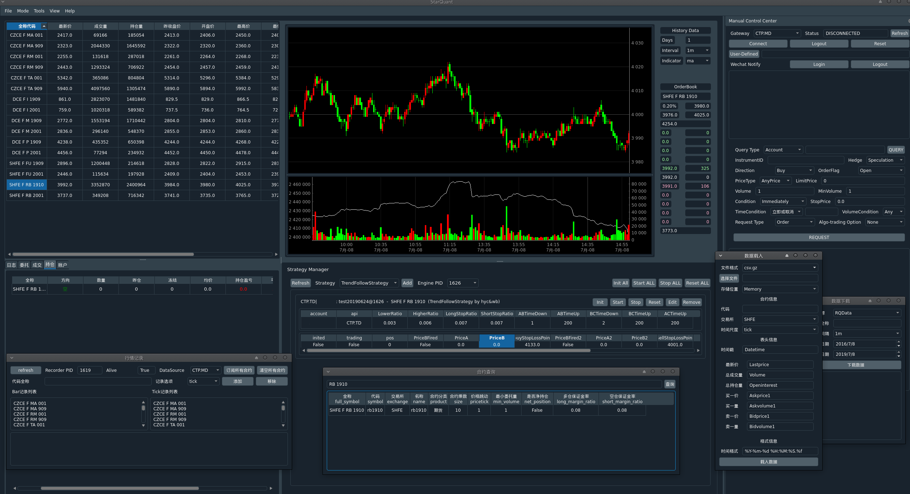
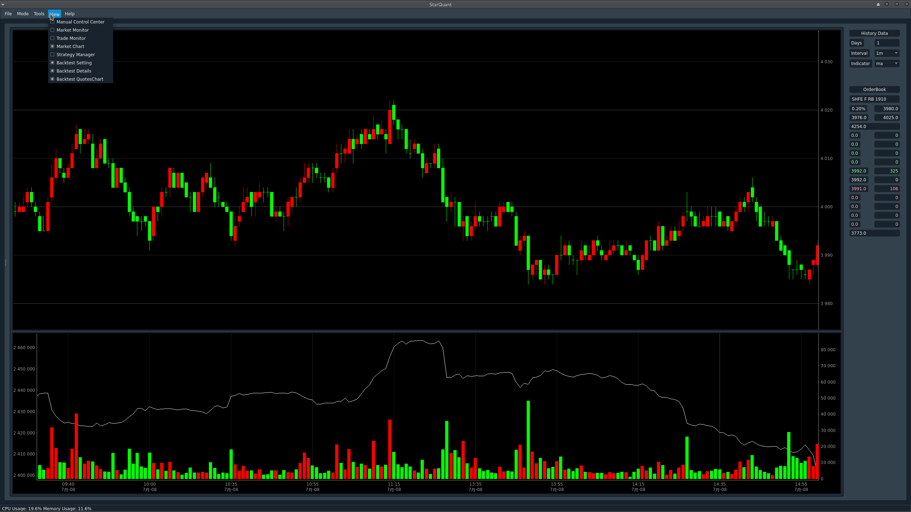

Welcome to StarQuant
==================

<p align="left">
   
   
    
    
    
    
</p>

[English](README_eng.md) 


**StarQuant**(中文名：易数交易系统)是一个轻量的、面向个人( 普通）用户的综合量化交易回测系统，目前主要用于期货期权程序化交易，后期会考虑加入股票交易的功能。

当前进展：完成1.0版本alpha版本，在实盘测试中：

1）对于流动性好，盘口大的品种非大笔交易下tick级回测与实盘的成交时间和价位一致；

2）无人工干预 7*24h连续工作，api柜台自动重连断开，行情自动记录，策略自动初始化、开始和停止；


## 功能特色

* 采用多进程和多线程模式，行情交易接口，策略执行，gui界面均为独立进程，进程之间通信采用消息队列，延迟在百微秒量级（实测在30-100微秒之间），对于普通用户延迟足够低 (保留了共享内存通信的接口，后续可以基于共享内存（如kungfu的易筋经）实现百纳秒到微秒级的低延迟)；
* 支持实盘程序化交易，支持多个API接口（ctp穿透式, xtp，易盛内外盘等），支持多个期货公司账号同时登录， 多个策略组独立运行，可设置触发条件实现自动登录，登出，重置等，可以实现7*24小时工作;具有风险控制模块，可以设置流控、总量控制等参数;　支持本地条件单（止损），一键全撤，平仓等自定义指令类型；
* 支持策略的实时动态管理（增加，删除，编辑参数，启动，停止，重新载入等，类似vnpy的ctastrategy 模块），可以管理多个策略进程；
* 支持python语言的策略回测和实盘交易，回测框架是基于vnpy改写，支持动态重新加载策略，策略在回测和交易程序中形式一样，无需重写代码, 同时python策略的数据格式、函数形式与vnpy兼容，方便转换、迁移和测试；
* 支持bar和tick不同时间尺度回测；为加速tick级回测，可以采用内存数据，一次导入后无需重复导入，对tick级回测节省大量时间（一个月百万级tick数据回测在5秒左右，正常导入数据需要的时间则高一个量级，在40秒左右）；
* 回测结果可以查看总体指标（收益率，夏普率，最大回撤等），收益曲线，所有成交明细，每日明细，在k线上显示对应买卖点标记，方便分析；回测结果可以导出为csv和相应图片；
* 支持回测参数优化筛选功能，可以多进程参数优化和遗传算法优化;可以批量回测不同合约，方便将不同主力合约一起回测；
* 支持实盘行情订阅和数据存储（tick,bar），类似vnpy的data recorder, 单独进程模式，同时也具有vnpy的csv loader的功能，支持bar和tick数据导入；支持从多个数据源下载数据（RQData，Tushare，JoinQuant）；
* 支持基于实盘行情数据的模拟交易（Paper brokerage，简单的撮合），方便实盘前的测试；
* 采用Qt可视化界面作为前端，方便管理，监控和操作，相关监控信息均有记录，可以导出为csv文件；可以查看实时k线数据；可以查看合约基本信息；可以选择性显示/隐藏指定视图控件单元，调整视图布局；
*  支持微信实时推送和接收信息（itchat 或Server酱等方式)
*  Linux，windows跨平台支持；

## 系统架构

系统主框架基于c++实现，采用c-s架构，基于事件驱动模式，采用模块化松耦合设计，服务端的行情，交易、数据记录为单独线程，服务端与gui界面、策略之间的进程通信采用消息队列方式（nanomsg），行情数据可以通过相关端口以消息形式转发到策略进程，策略下单操作也通过相关端口将指令转发到服务端，然后调用相关柜台api，行情api支持CTP，TAP等，数据可以记录到本地（csv文件或Mongodb数据库），策略可以采用python或c++实现。GUI是基于PyQt5，支持手动交易，策略交易，委托持仓账号等信息查看。

注：开源的代码主要展示了系统的原型和框架，方便在此基础上二次开发和定制，定制化的代码未开源。


## 开发环境
本系统在开发过程中参考了已有的开源软件vnpy,kungfu，EliteQuant等。
开发环境：

(1) Manjaro（arch，Linux内核4.14)，python 3.7.2，gcc 9.1

(2) windows 10测试通过，visual studio 14 2015 

第三方库：
boost 1.69
nanomsg
log4cplus
yamlcpp
libmongoc-1.0
fmt

python依赖psutil，pyyaml,pyqt,qdarkstyle等包。

## 运行

首先需要编译完成cppsrc下的库，需要事先安装boost，nanomsg以及CTP,TAP等柜台api的动态链接库。
编译过程和原项目类似，使用 [CMake](https://cmake.org) 进行编译：

```
$ cd cppsrc
$ mkdir build
$ cd build
$ cmake ..
$ make
```
编译完成后将cppsrc/build/StarQuant下的可执行文件apiserver.exe拷贝到主目录运行即可启动服务端，
gui界面执行gui.py即可启动，运行strategy.py可启动单独的策略进程，运行recorder.py可启动行情记录进程。

## 编写约定
-------------------
c++参考google 的c++ guide, cpplint检查；

python 采用flake8检查，autopep8格式化；

变量命名：类名采用驼峰式，单词首字母大写，不包含_字符；类成员变量字母一般小写，后加_，如data_,全局变量加g_修饰，函数一般大小写混合形式。


## 使用说明
-------
品种符号约定：
  采用全名的形式：交易所 类型 商品名 合约，如SHFE F RB 1905
  对于ctp，程序内部api会转换为对应的简写形式，rb1905，
行情、交易、策略之间消息传递的格式：消息头|消息内容
 消息头:目的地|源地址|类型，类型有：

 消息内容：对应类型的数据


## Demo
-----------




## TODO

本系统完成了版本1.0的alpha版本，正在实盘测试中。


